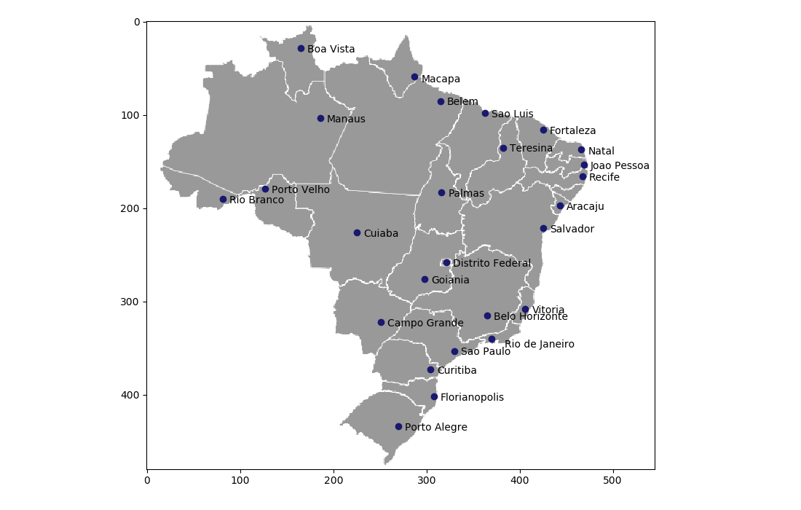
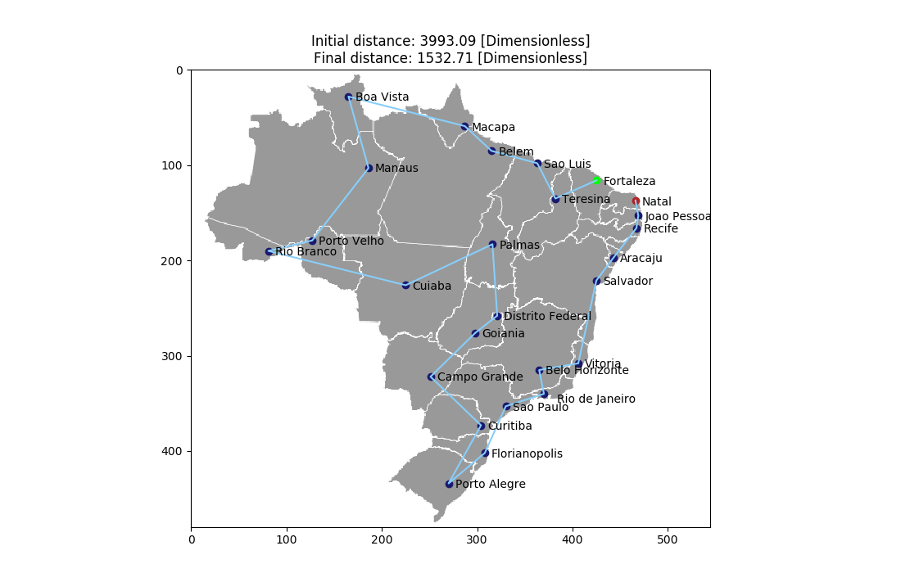

# ann_xor
A genetic algorithm to solve the Travelling Salesman Problem implemented in Python.

# 

This is an example of trajectory.

# 

## License

All Solutions licensed under MIT License. See LICENSE for further details.
